# User Authentication

## Create Account

User is greeted with an option to sign up:

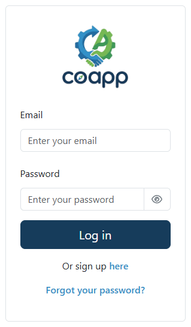

After filling in their details:

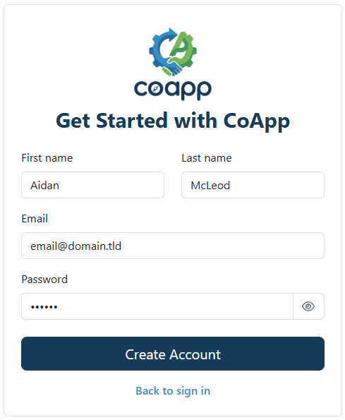

They are sent an email and asked for the code that was sent, with an option to resend the code:

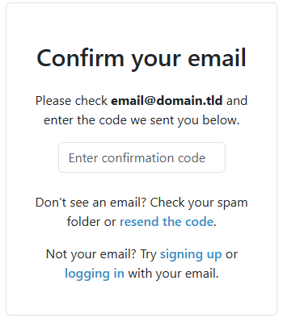

If the user provides an invalid email, they will be shown an error

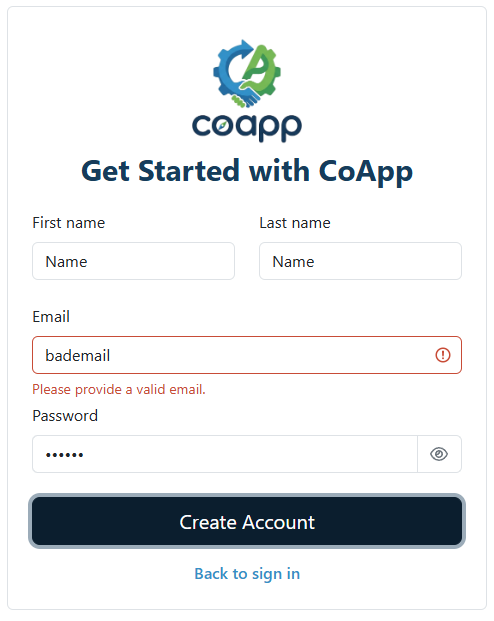

If the user tries to sign up for an account using an email already associated with an account, they will presented an error

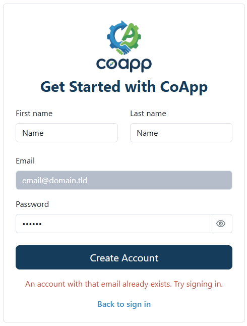

If the user tries to use an invalid password, they will be shown an error message

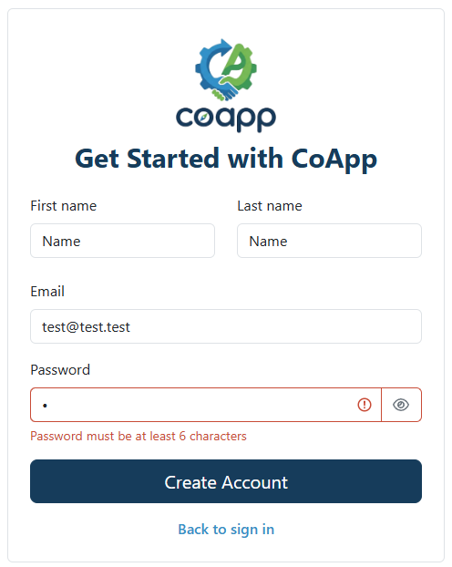

After confirming their email, the user is logged in

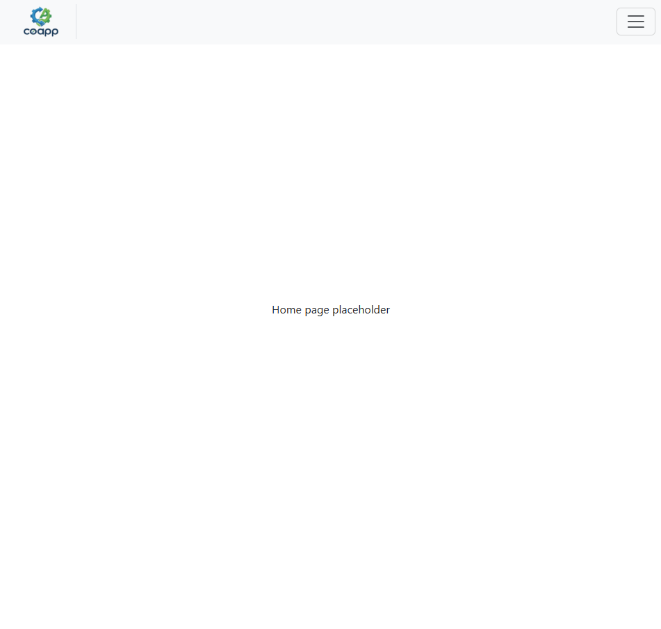

Or can log in using their credentials previously entered.

## Login 

When the user enters their credentials they are able to log in

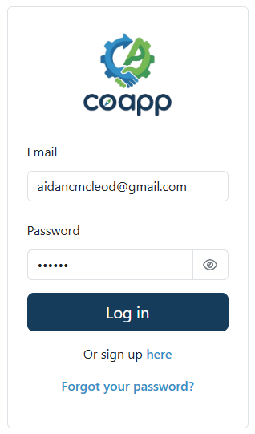

If they enter their credentials incorrectly, they are shown an error message

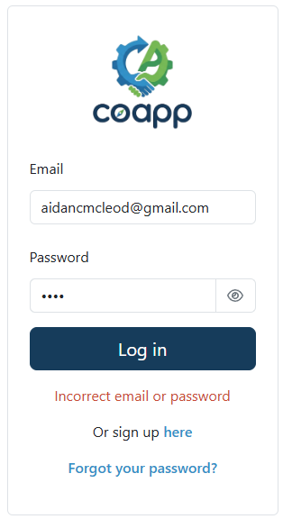

## Log out

When logged in, users are given the option to sign out

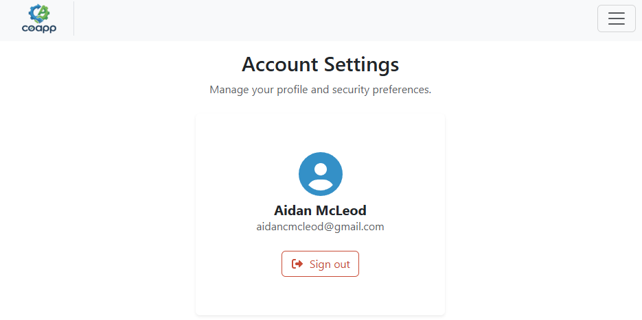

After clicking sign out, they will be redirected to the login page

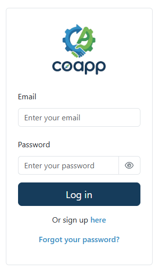

## Change Password

Clicking the profile button in the top right will bring the user to their account settings page

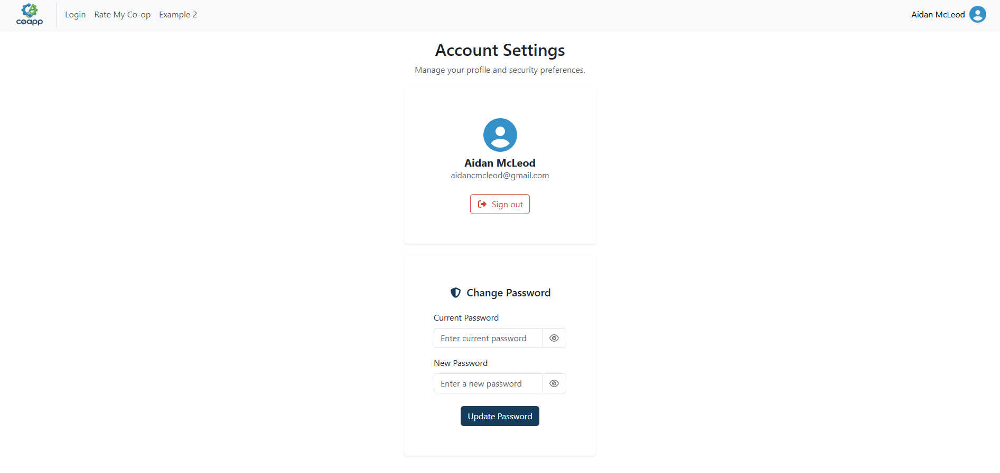

If the user enters their password and a new password, they can change their password, which they will need to use the next time they log in

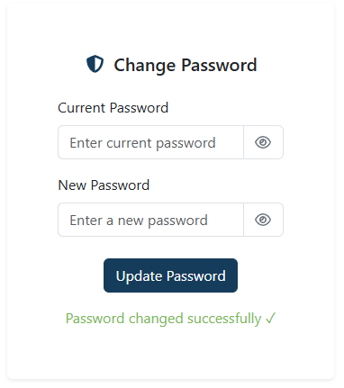

If the user enters their current password incorrectly they are shown an error message 

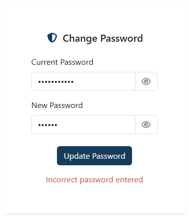

If the user enters an invalid password they will be shown an error message 

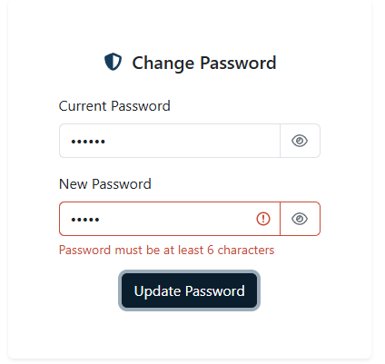

And if the user enters the same password as their old password, they will be shown an error message 

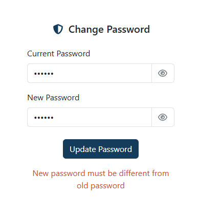
