# Application Filtering/Search

## Sort by date

- Given that I’m on the applications screen, when I click on an “up arrow” button next to the date applied field, then I will be shown the list of applications in order of the date ascending

First click the calendar filter button
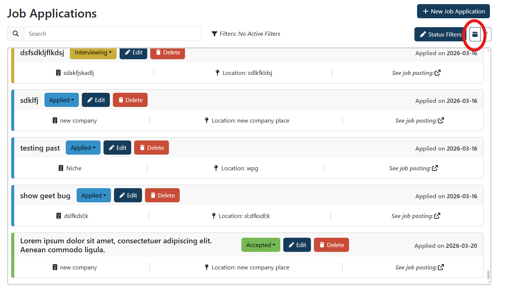

Then, click the arrow to switch it from "down" to "up"
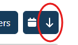

Now the arrow points up, and the dates are in ascending order
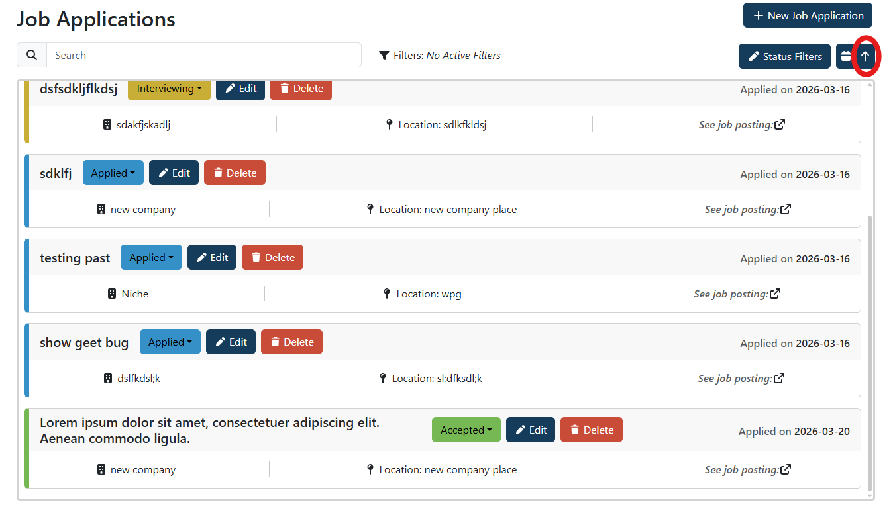

- Given that I’m on the applications screen, when I click on an “down arrow” button next to the date applied field, then I will be shown the list of applications in order of the date descending

First click the calendar filter button

By default, it sorts descending.

- Given that I’m on the applications screen and have previously selected one of the up or down arrows, when I clicked on the arrow that I selected, then the list will be returned to its “default” ordering

First click the calendar filter button

By default, it sorts descending.

If we click the arrow to switch it from "down" to "up"

Then arrow points up, and the dates are in ascending order

If we then click the arrow to switch it from "up" to "down", we see the arrow points down and the dates are now in descending order
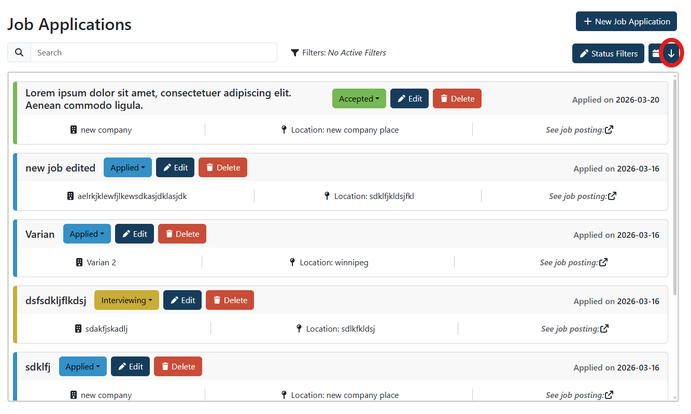

## Filter by status

- Given that I’m on the applications screen, when I click on a “filter by status” button, then I will be shown a list of statuses that I can select from

Clicking on "status filters" will show all available statuses to filter by
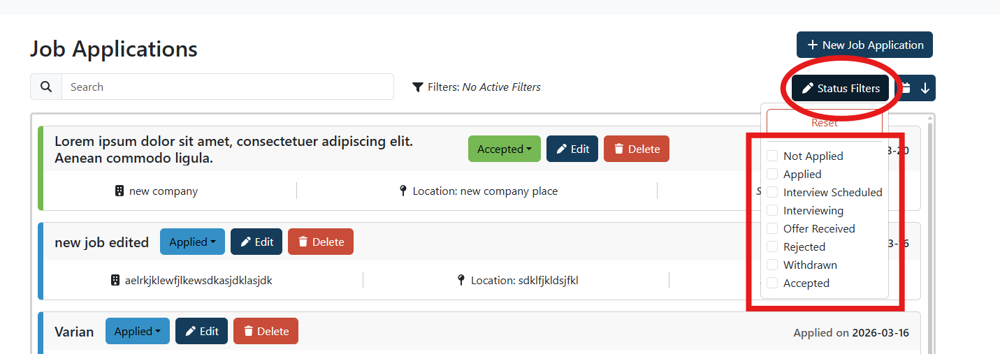

- Given that I see the list of statuses, when I click on one or more of the statuses, then I will only see applications that have statuses that match my selections.

Clicking on just "Accepted"
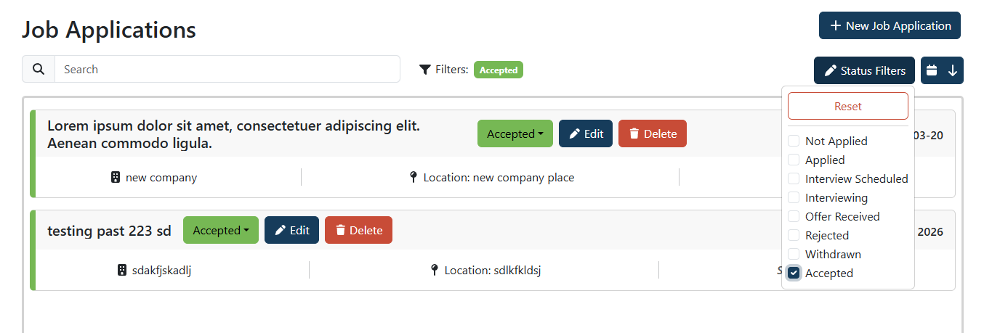

Clicking on "Accepted" and "Interviewing"
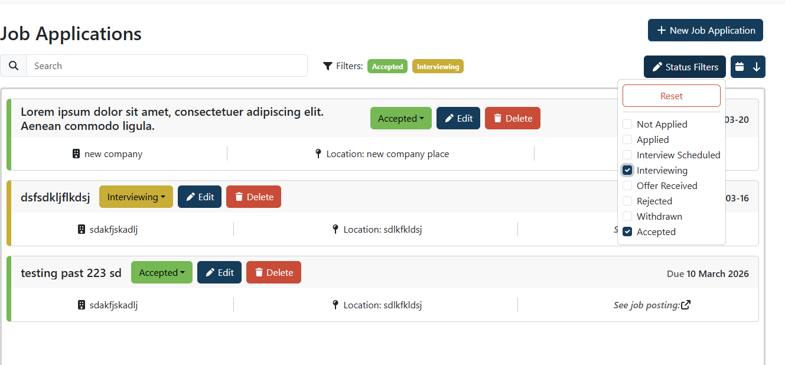

- Given that I see the list of statuses and have previously selected statuses to filter by, when I click on one or more of the statuses that I have previously selected, then I have de-selected those statuses as filters.

No filters
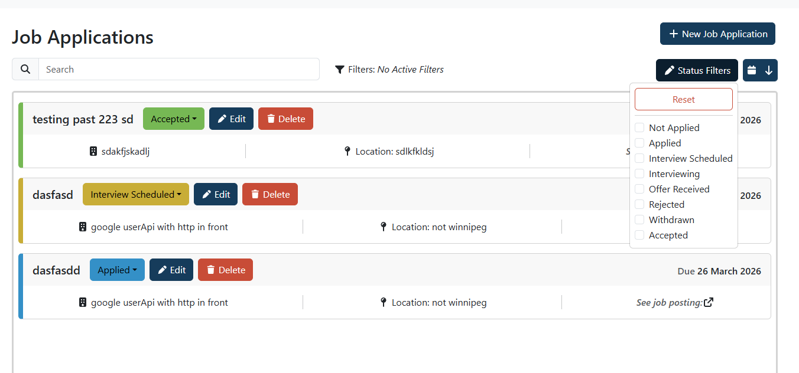

Applied and accepted
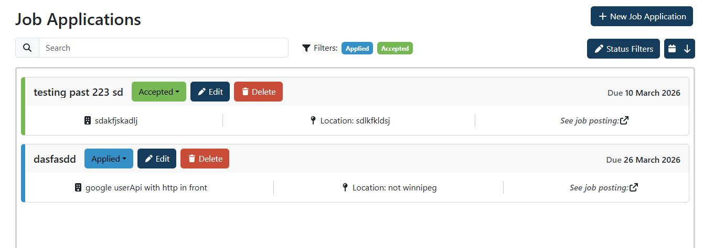

Removal of applied, just accepted
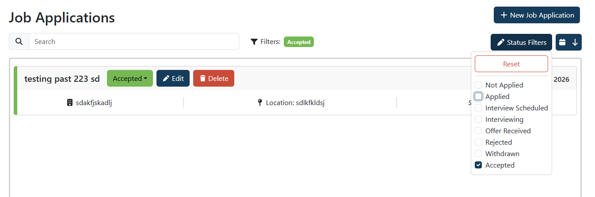

Removal of accepted. No filters
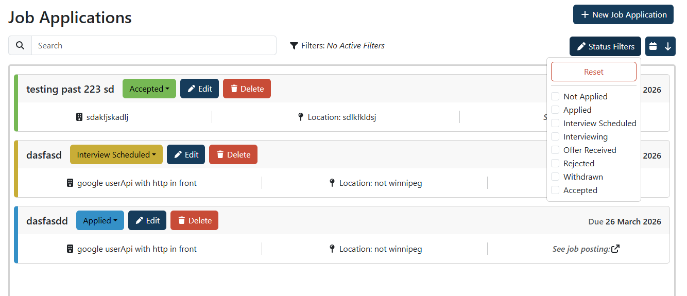

## Search by Company

- Given that I’m on the “applications” screen, when I type in a search bar, then I will see a list of applications that “match” what I input into the search bar, while applications that don’t “match” are hidden

Primary "Match" was decided to be "company name starts with" the searched string, while a secondary match is "company name includes" the searched string

Current applications
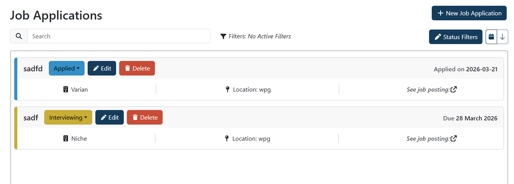

Primary match for "Niche"
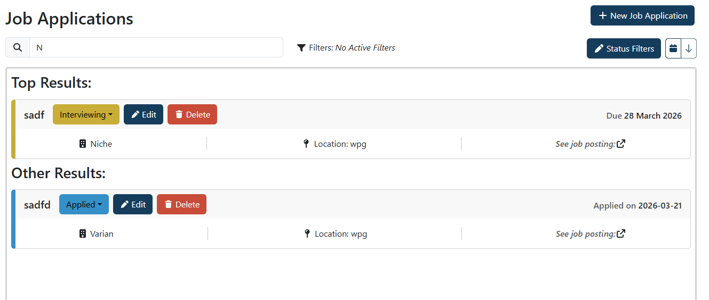
Note Varian ends in an "n", so it will show up as a secondary match

Primary match for "Niche", hiding "Varian"
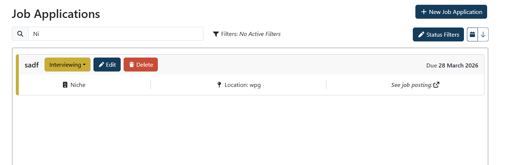

Secondary match for "Niche"
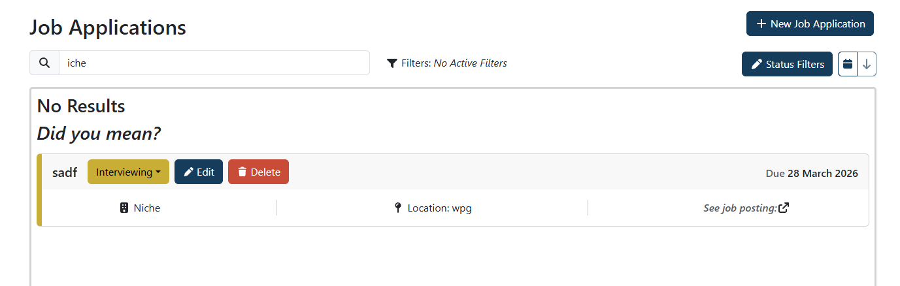

- Given that I have typed something into a search bar, then when I delete the input, then I will see the full list of applications once more

From this state:

If we delete the search bar we get both applications:
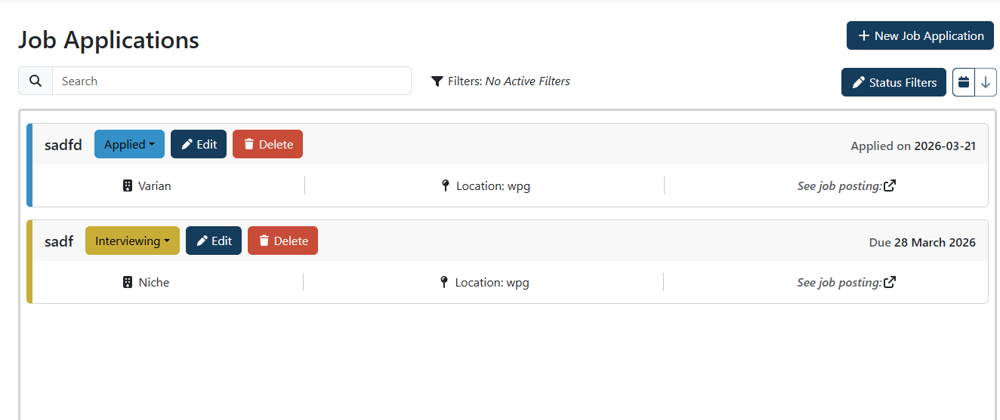