# Rate-My-Co-op

## Adding company profile:

Given that I’m on the Company Wiki screen and want to create a new company entry, when I click the “Create A New
Company Profile” button within the page, then I will be directed to the Create A New Company form to create a new company profile.

On the screen, press this button
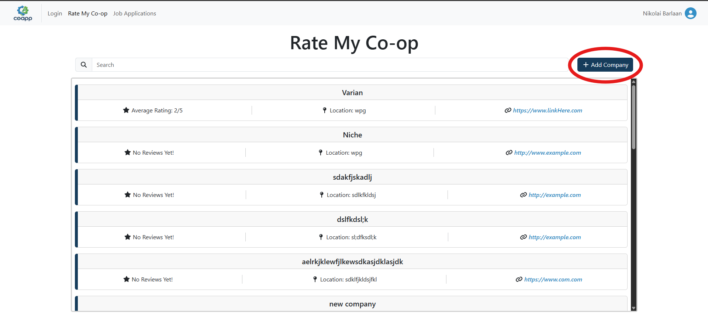

After clicking, user sees the Create A New Company modal.
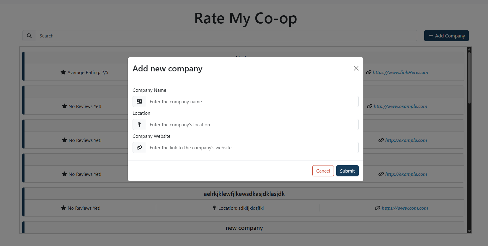

Given that I have completely filled in the form with valid information and the company has not yet been created, when I select the “Create” option, then I will be redirected to the Company Wiki screen and see the new company I added.

Fill in the fields, then click submit
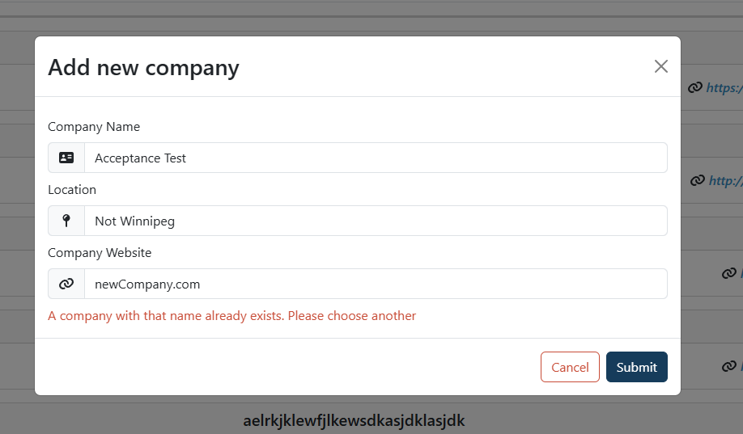

When it's finished, the modal will close and user can see the company they just added.
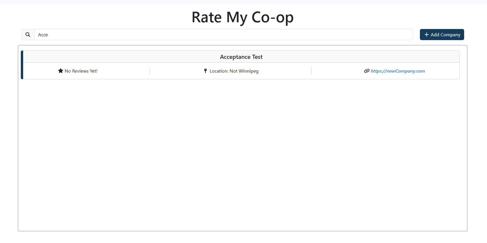

Given that I have completely filled in the form with valid information and the company has been created, when I try to create another company of the same name, then I should see a notification saying the company already exists and the company profile could not be created.

Note that "Acceptance Test" has already been created

Attempting to create a company with the same name results in an error
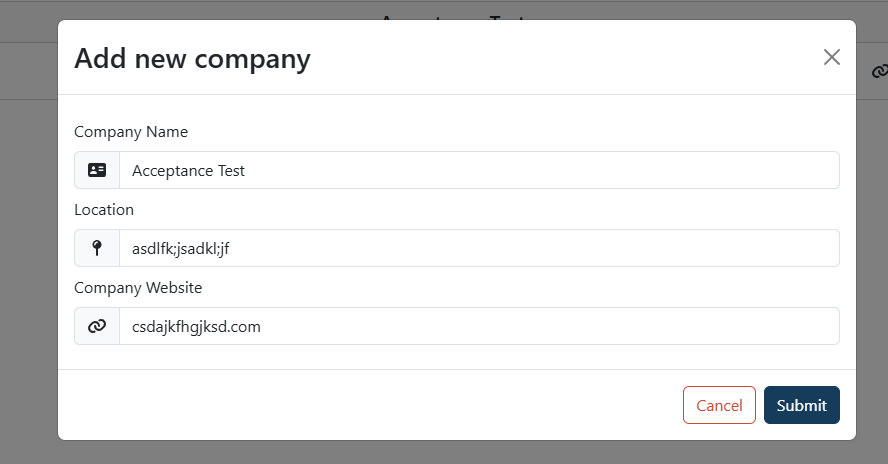
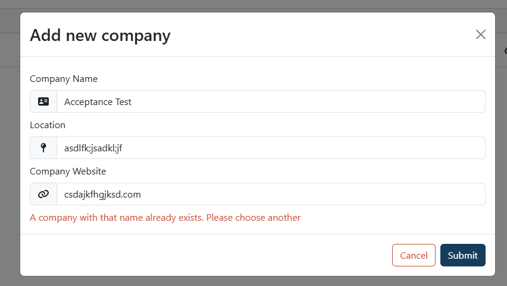

Only one instance exists after attempting to create another "Acceptance Test" company
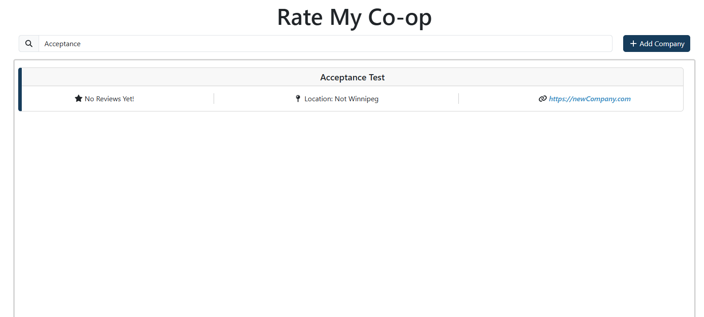

Given that I have incompletely filled in the form, when I select the “Create” option, then I should remain on the form and the missing fields should be marked in red. 

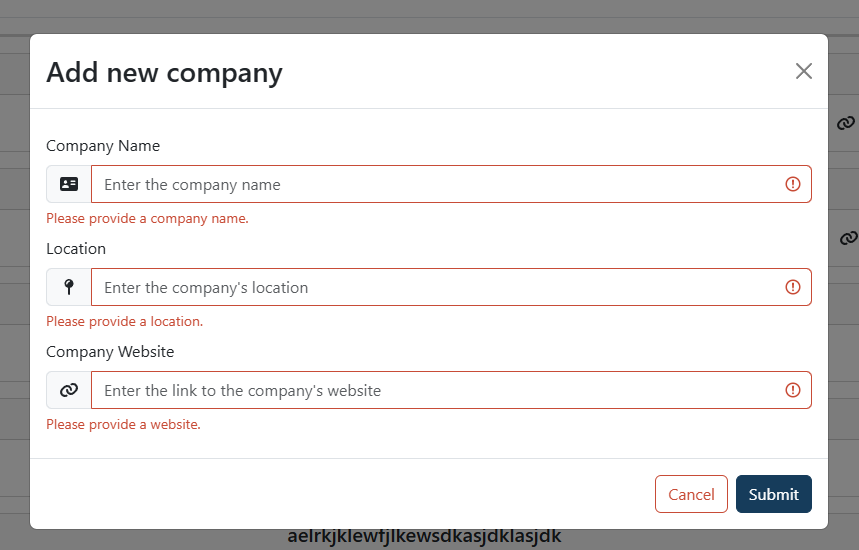

If we fill in one of the fields, the red error goes away for only that field.
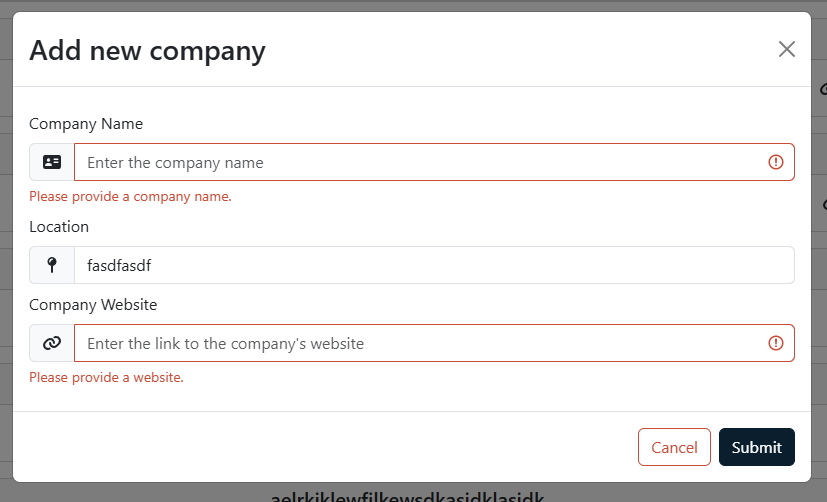

## Writing a review

Given that I’m on the Company Wiki screen, when I click on a company name, then I should be directed to the company profile.

Clicking on one of the company cards pulls up a full screen modal of the reviews
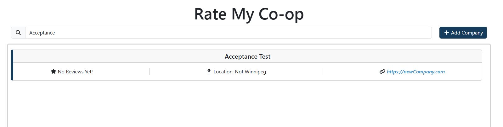
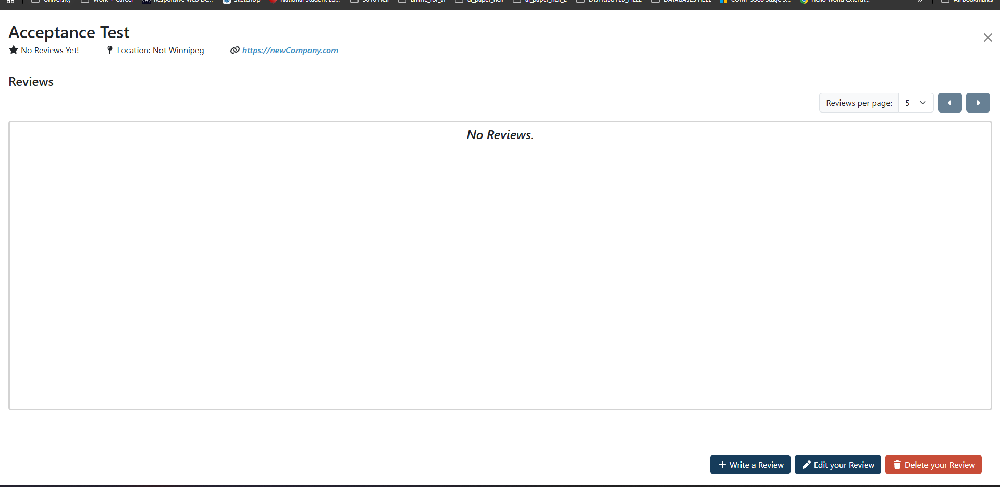

Given that I’m looking at a company profile, when I look at the bottom of the page, then I should see a button to “Add A New Review”.

You can see that button here
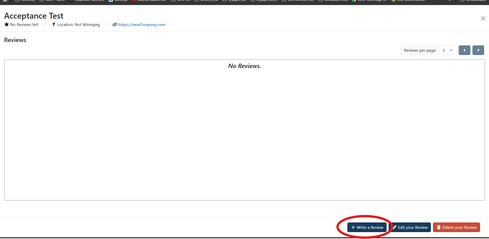

Given that I’m looking at the “Add A New Review” button, when I click the button, then I should be directed to the form to add a new review.

The reviews page is replaced with a form for adding your own review
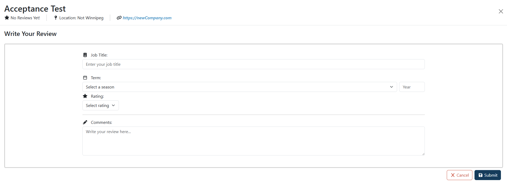

Given that I have incompletely filled in the form, when I select the “Create” option, then I should remain on the form and the missing fields should be marked in red. 

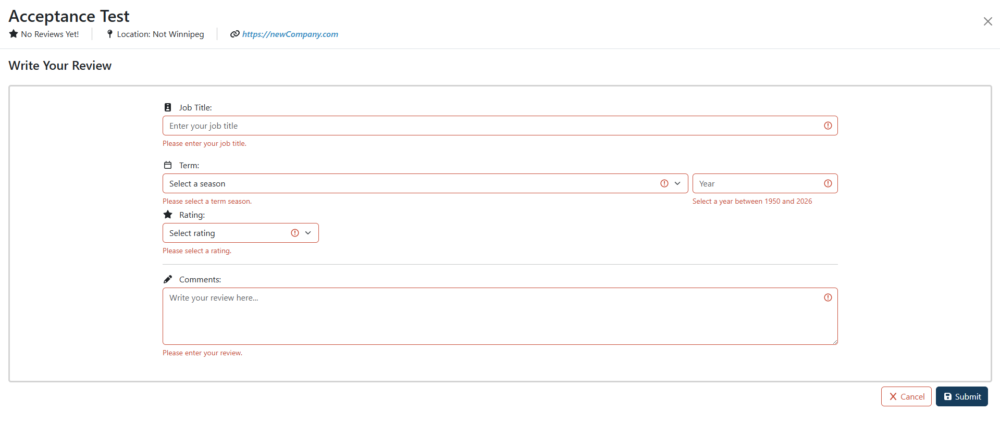

If we fill in one of the fields, the red error goes away for only that field.
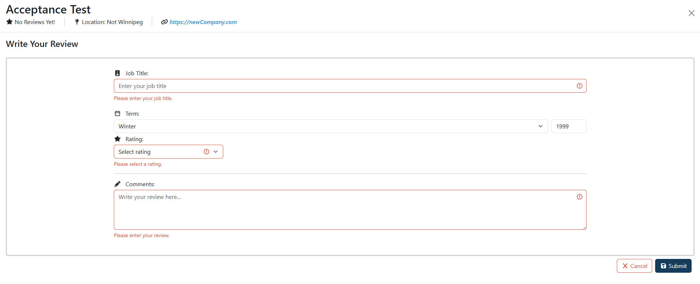

## Reading Reviews

Given that I’m on the Company Wiki screen, when I click on a company name, then I should be directed to the company profile.

If you click on a company, you'll be directed to the company's profile.
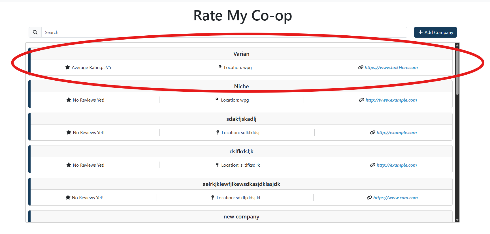
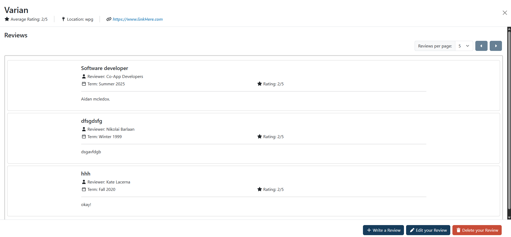

Given that I’m looking at a company profile and there are reviews that exist for that company, when I look at the reviews section, then I should be able to see the reviews about the company.

Each of these cards is its own review
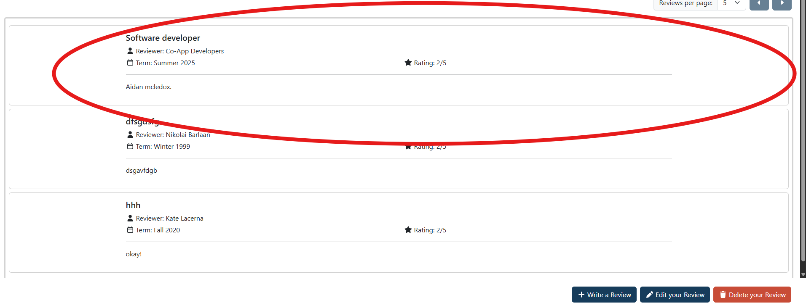

Given that I’m looking at a company profile and there are no reviews that exist for that company, when I look at the reviews section, then I should see a message saying that there's no reviews.

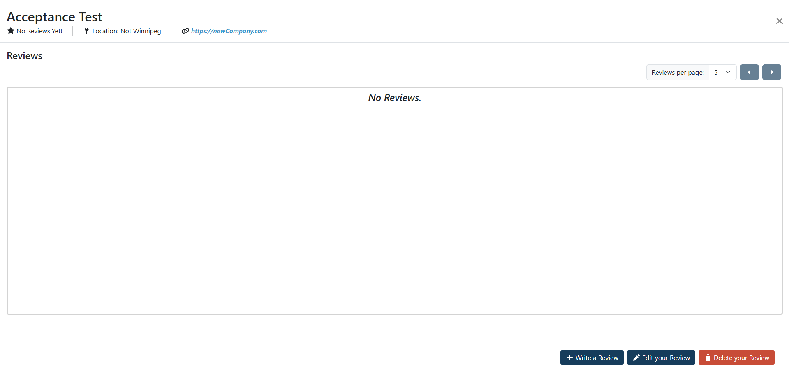

Given that I’m looking at the reviews about the company and there are more reviews that are not displayed on the page, when I look at the top-right corner, then I should be able to see a "next page" button.

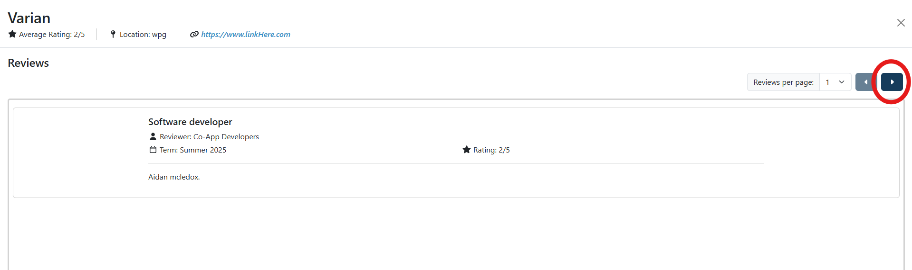

Given that I click the next page button, when I look at the reviews section, then I should be able to see a new set of reviews.

Upon clicking the next page button, user gets a different set of reviews.
(In this case, a new set of one reviews, since we don't have enough reviews in the database yet to show this with larger sets of reviews)
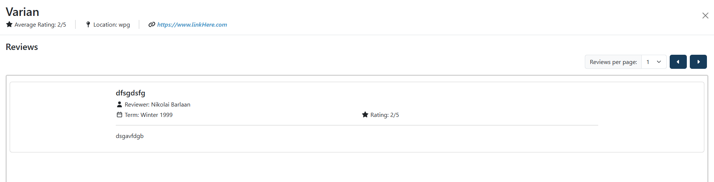

Given that I've clicked the next page button and a previous page exists, when I look at the top-right corner, then I should be able to see a "previous page" button.

Note that on the second page, the previous page button is now clickable. Where previously it was greyed out.
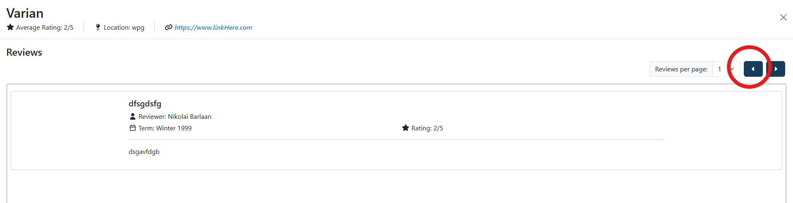

Given that I click the previous page button, when I look at the reviews section, then I should be able to see a previous set of reviews.

Note that this set is the first page's set of reviews.
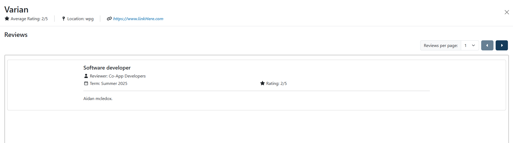