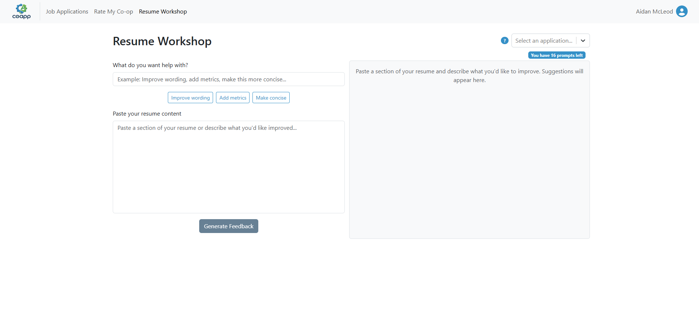
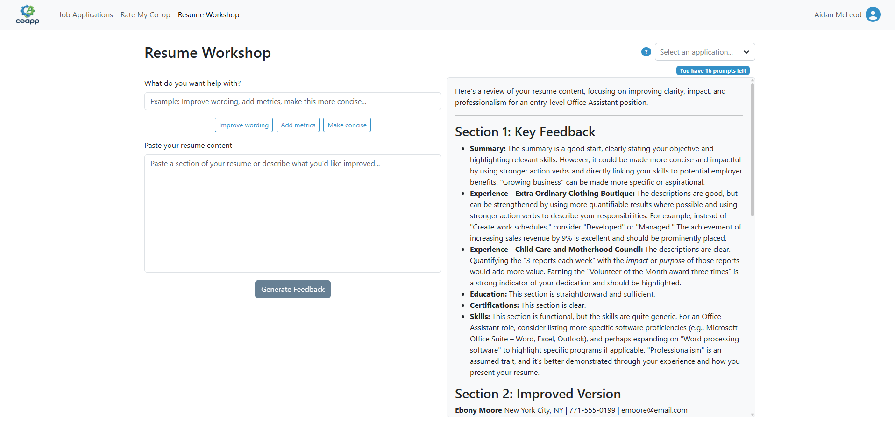
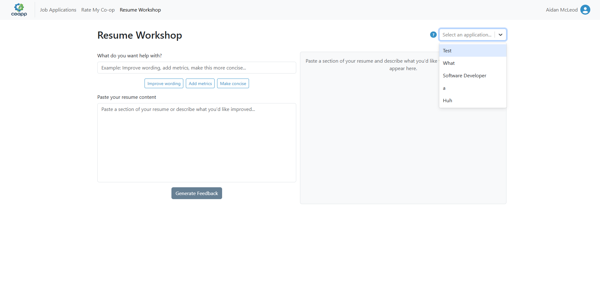
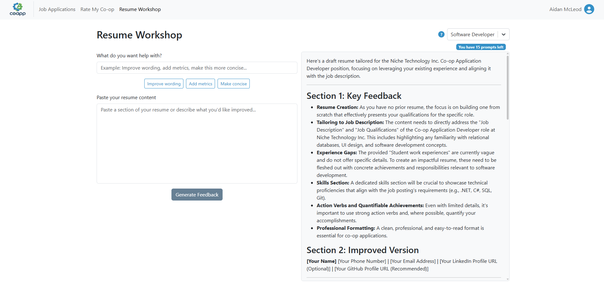
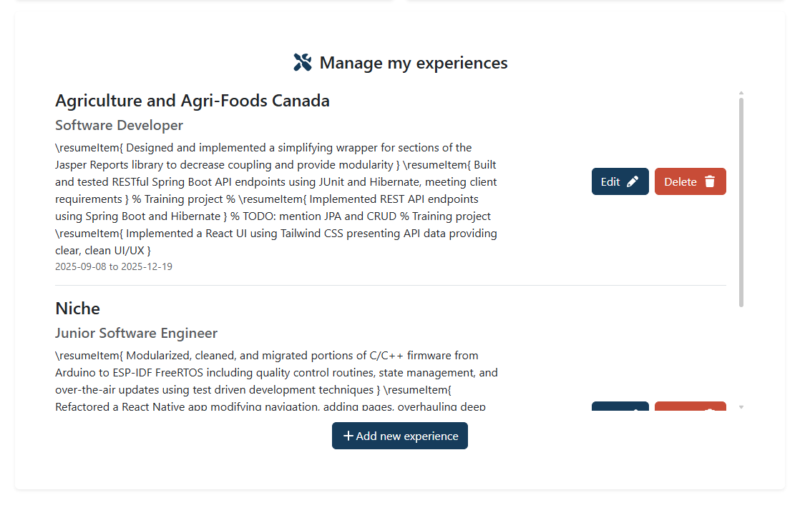
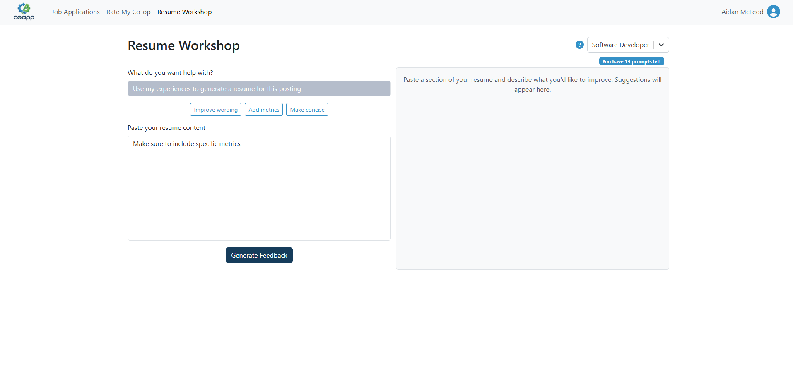
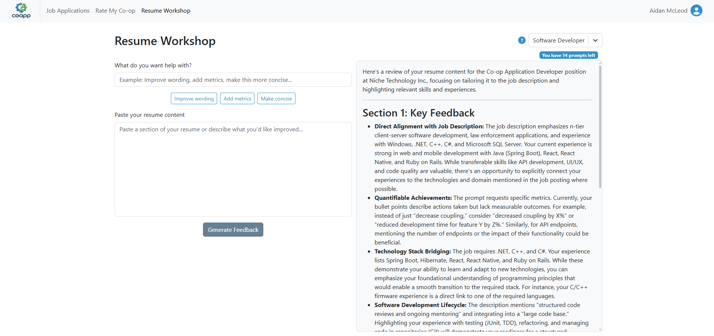

# AI Resume Helper

## Enter a query

- Given that I’m on the main page, when I select the option “Improve my resume with AI” located on the navbar, then I should be directed to the conversation UI like ChatGPT.

Clicking the "Resume Workshop" on the navbar takes the user to a page where they can improve their resume with AI:

- Given that I’m on the conversation UI, when I copy and paste sections of my resume into the prompt and ask the AI chatbot to perform the tasks, then I should be able to see the feedback from the chatbot about my resume. 

Copy/pasting a sample resume into the chatbot we can see feedback from the bot about what can be improved:

## Auto-fill job context

- Given that I’m on the main page, when I select the option “Improve my resume with AI” on the navbar, then I should be directed to the conversation UI like ChatGPT.

See Enter a query section.

- Given that I’m on the conversation UI, when I click on the option "Select a job", then I should see a selection of the jobs that have been listed so that I can ask the AI chatbot for specific feedback for the selected job listing.

Clicking "Select an application" the user can see a list of their job applications to select as context.

- Given that I clicked on the option "Select a job" and I see the listed jobs, when I select one of the jobs, then I will receive specific feedback from the chatbot regarding tailoring my resume to that job.

Selecting the job application for Niche, the AI provides tailored feedback for that posting:

## Understand context about me

- Given that I’m on the main page, when I select the option “Improve my resume with AI” on the navbar, then I should be directed to the conversation UI like ChatGPT.

See Enter a query section.

- Given that I’m on the conversation UI, when I perform prompting with GenAI as in feature 1, I should receive feedback from the AI chatbot with the context of my profile.

After entering experiences:

We can prompt the bot:

And it will respond with information specific to my experiences:

